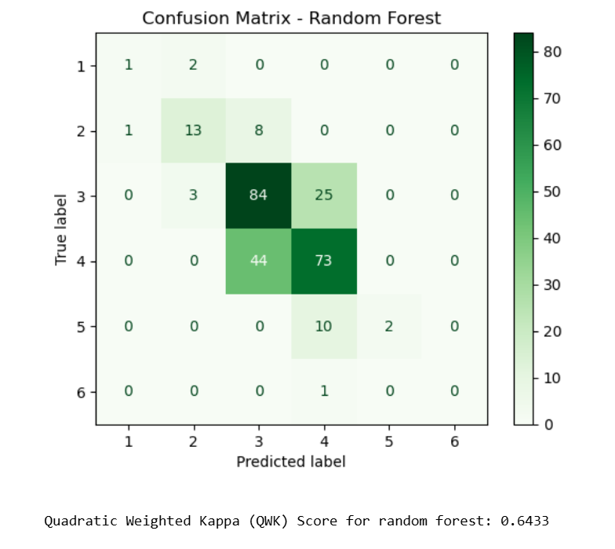

# Essay-score-prediction

## 📌 Overview

This project is part of my university coursework for the **F78DS Data Science Life Cycle** module. The goal is to predict essay scores using supervised machine learning techniques applied to structural and linguistic features of student essays.

The project includes:
- Feature selection & data normalization
- Model building with **Naive Bayes** and **Random Forest**
- Evaluation using **Quadratic Weighted Kappa (QWK)**
- Submission of predictions to an internal **Kaggle competition**

---

## 📂 Dataset

- Each essay is represented using 19 numeric features
- Target variable: `score` (ranging from 1 to 6)
- `F78DS-Essay-Features.csv`: Training data with features + essay scores  
- `F78DS-Essay-Features-Submission.csv`: Kaggle test dataset (no scores)
- `H00453164-Aushat-1.csv`: Naive Bayes Kaggle submission
- `H00453164-Aushat-2.csv`: Random Forest Kaggle submission  
- `H00453164_cw2.ipynb`: Jupyter Notebook with full project code  
- `confusion_matrix_rf.png`: Confusion matrix for Random Forest model  
---

## 🛠️ Tools & Libraries

- Python (Jupyter Notebook)
- `pandas`, `numpy`, `matplotlib`, `seaborn`
- `scikit-learn`: for classification models and evaluation
- `cohen_kappa_score`: for QWK metric

---

## 🔍 Methods

### 🧪 Supervised Learning
- Problem type: **Multi-class classification**
- Train-test split (80/20), with stratification
- Feature normalization using `MinMaxScaler`

### 📈 Models Used
- **Gaussian Naive Bayes**: Chosen for its simplicity and efficiency on scaled continuous data
- **Random Forest**: Evaluated as an alternative due to its robustness and handling of complex patterns

### 🧪 Evaluation Metric
- **Quadratic Weighted Kappa (QWK)**: Measures how close predictions are to the true scores, accounting for the order of the labels

---

## ✅ Results

| Model          | Mean CV QWK | Test QWK | Kaggle QWK (Final) |
|----------------|-------------|----------|---------------------|
| Naive Bayes    | 0.6463      | Higher   | Slightly lower      |
| Random Forest  | 0.6488      | Slightly lower | **Higher ✅** |

🔚 **Final submission**: Random Forest (`H00453164-Aushat-2.csv`)

---

## 📷 Sample Visual

Here’s a confusion matrix of Random Forest performance on the test set:

---

## 🧠 Key Takeaways

- Normalization significantly improved model fairness and accuracy
- Simpler models like Naive Bayes can outperform complex ones in some cases
- Cross-validation and proper metric selection are key to model evaluation
- Kaggle submissions helped validate performance in real-world conditions

---

## 💡 Future Ideas

- Try ensemble methods or hyperparameter tuning
- Address class imbalance with techniques like SMOTE
- Add NLP features (e.g., sentiment, coherence score)

---

## 📬 Contact

 [LinkedIn](https://your-linkedin-url)  
